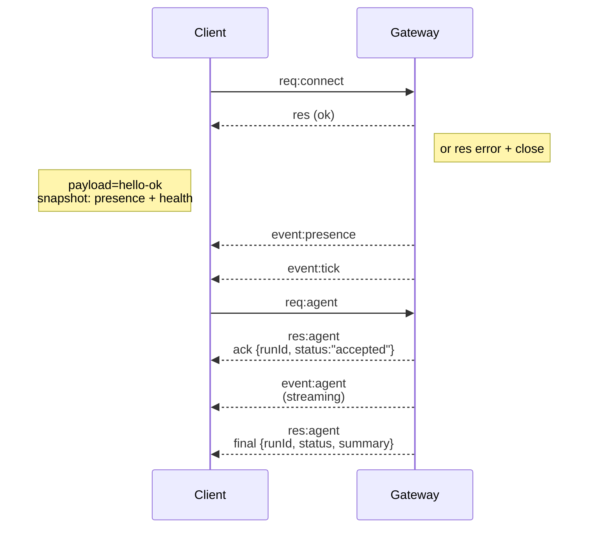

## 概覽

- 一個長期運行的 **Gateway** 守護程式擁有所有訊息介面（WhatsApp 透過 Baileys、Telegram 透過 grammY、Slack、Discord、Signal、iMessage、WebChat）。
- 控制面板客戶端（macOS 應用程式、CLI、Web UI、自動化任務）透過 **WebSocket** 連線到 Gateway，預設綁定主機位址為 `127.0.0.1:18789`。
- **Node**（macOS/iOS/Android/無頭模式）同樣透過 **WebSocket** 連線，但會宣告 `role: node` 並附帶明確的能力/命令。
- 每個主機僅執行一個 Gateway；它是唯一開啟 WhatsApp 工作階段的位置。
- **Canvas 主機**由 Gateway HTTP 伺服器提供服務，路徑如下：
  - `/__openclaw__/canvas/`（Agent 可編輯的 HTML/CSS/JS）
  - `/__openclaw__/a2ui/`（A2UI 主機）
  使用與 Gateway 相同的連接埠（預設 `18789`）。

## 元件與流程

### Gateway（守護程式）

- 維護供應商連線。
- 提供型別化的 WebSocket API（請求、回應、伺服器推送事件）。
- 根據 JSON Schema 驗證入站訊框。
- 發出 `agent`、`chat`、`presence`、`health`、`heartbeat`、`cron` 等事件。

### 客戶端（Mac 應用程式 / CLI / Web 管理介面）

- 每個客戶端一條 WebSocket 連線。
- 傳送請求（`health`、`status`、`send`、`agent`、`system-presence`）。
- 訂閱事件（`tick`、`agent`、`presence`、`shutdown`）。

### Node（macOS / iOS / Android / 無頭模式）

- 連線至**相同的 WebSocket 伺服器**，帶有 `role: node`。
- 在 `connect` 中提供裝置身份；配對為**基於裝置**（角色為 `node`），批准狀態儲存在裝置配對儲存區中。
- 提供 `canvas.*`、`camera.*`、`screen.record`、`location.get` 等命令。

協定詳情：

- [Gateway 協定](/docs/gateway/protocol)

### WebChat

- 使用 Gateway WebSocket API 取得聊天記錄與傳送訊息的靜態 UI。
- 在遠端設定中，透過與其他客戶端相同的 SSH/Tailscale 通道連線。

## 連線生命週期（單一客戶端）



## 通訊協定（摘要）

- 傳輸層：WebSocket，JSON 格式的文字訊框。
- 第一個訊框**必須**為 `connect`。
- 握手完成後：
  - 請求：`{type:"req", id, method, params}` → `{type:"res", id, ok, payload|error}`
  - 事件：`{type:"event", event, payload, seq?, stateVersion?}`
- 若設定了 `OPENCLAW_GATEWAY_TOKEN`（或 `--token`），則 `connect.params.auth.token` 必須匹配，否則 Socket 會被關閉。
- 具有副作用的方法（`send`、`agent`）需要冪等鍵以安全重試；伺服器維護一個短期去重快取。
- Node 必須在 `connect` 中包含 `role: "node"` 以及能力/命令/權限。

## 配對與本地信任

- 所有 WebSocket 客戶端（操作者 + Node）在 `connect` 時包含**裝置身份**。
- 新的裝置 ID 需要配對批准；Gateway 會核發**裝置令牌**供後續連線使用。
- **本地**連線（回環位址或 Gateway 主機自身的 Tailnet 位址）可自動批准，以保持同主機的流暢體驗。
- 所有連線必須簽署 `connect.challenge` 隨機數。
- 簽名承載 `v3` 還會綁定 `platform` + `deviceFamily`；Gateway 在重新連線時會固定已配對的元資料，並要求重新配對以更新元資料。
- **非本地**連線仍需明確批准。
- Gateway 驗證（`gateway.auth.*`）適用於**所有**連線，無論本地或遠端。

詳情：[Gateway 協定](/docs/gateway/protocol)、[配對](/docs/channels/pairing)、[安全性](/docs/gateway/security)。

## 協定型別與程式碼生成

- TypeBox 結構描述定義協定。
- 從這些結構描述生成 JSON Schema。
- 從 JSON Schema 生成 Swift 模型。

## 遠端存取

- 建議方式：Tailscale 或 VPN。

- 替代方式：SSH 通道

  ```bash
  ssh -N -L 18789:127.0.0.1:18789 user@host
  ```

- 通道上適用相同的握手 + 驗證令牌。

- 可在遠端設定中為 WebSocket 啟用 TLS + 可選的憑證固定。

## 運維快照

- 啟動：`openclaw gateway`（前台執行，日誌輸出至 stdout）。
- 健康檢查：透過 WebSocket 的 `health`（也包含在 `hello-ok` 中）。
- 監管：launchd/systemd 用於自動重啟。

## 不變式

- 每個主機由一個 Gateway 控制一個 Baileys 工作階段。
- 握手為必要步驟；任何非 JSON 或非 connect 的首個訊框將導致硬關閉。
- 事件不會重播；客戶端必須在間隔中斷時重新整理。
